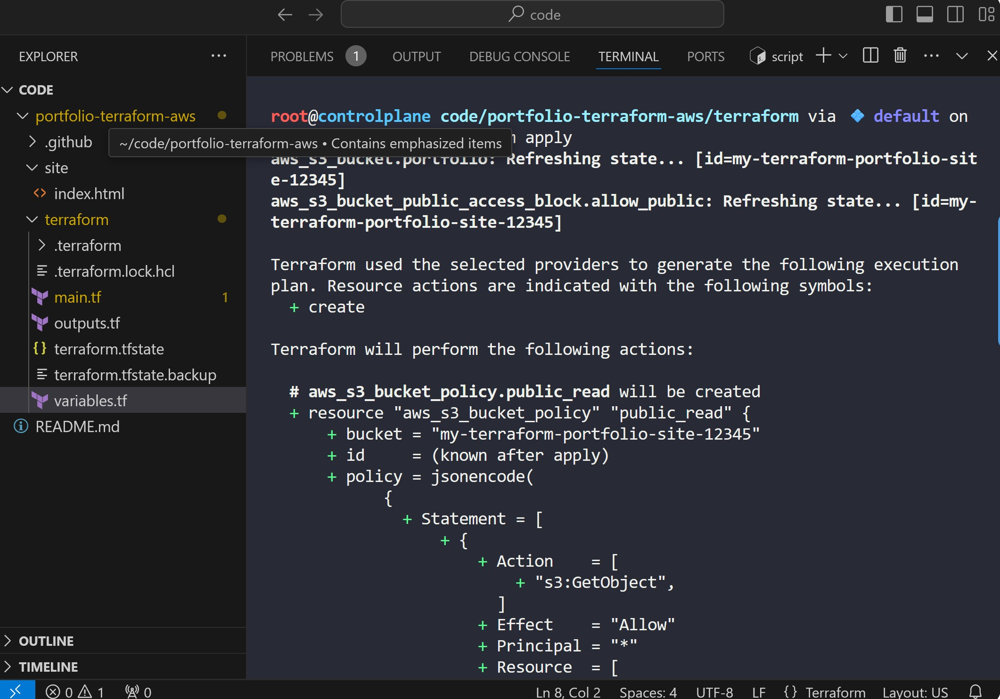
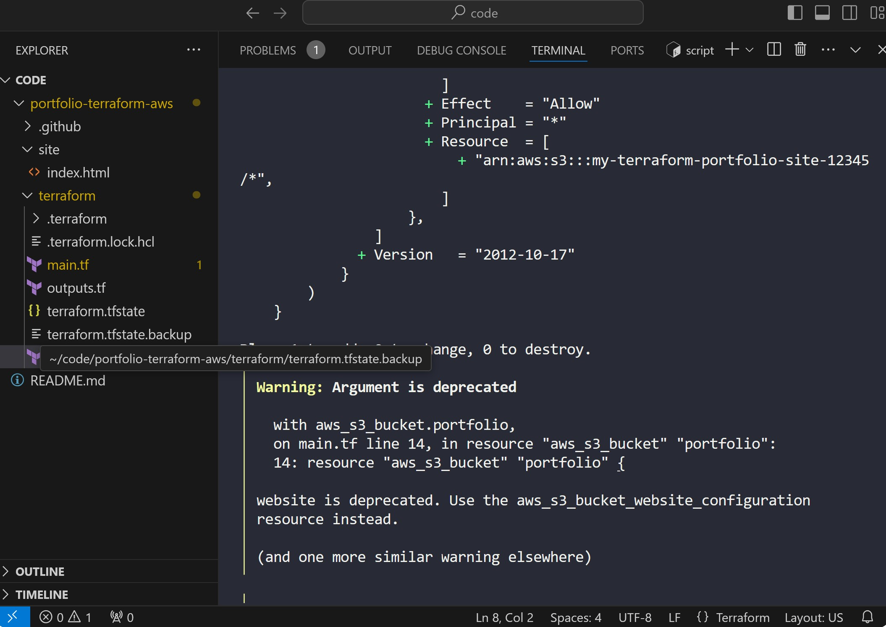
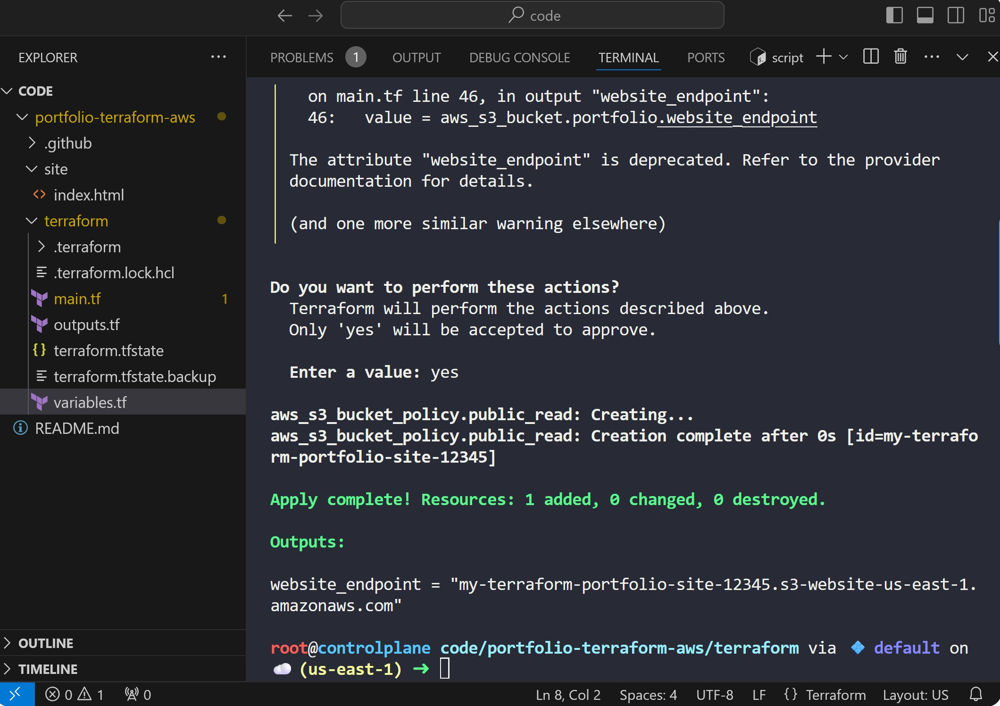
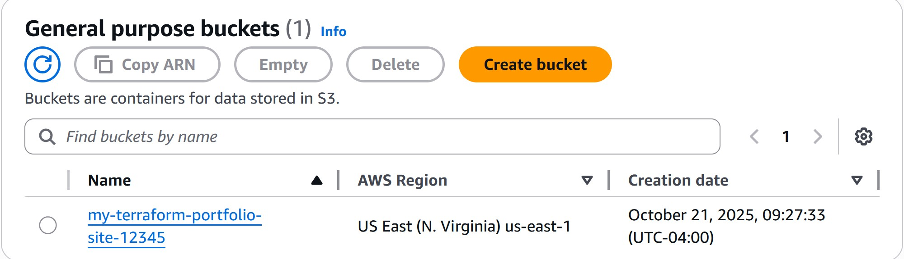
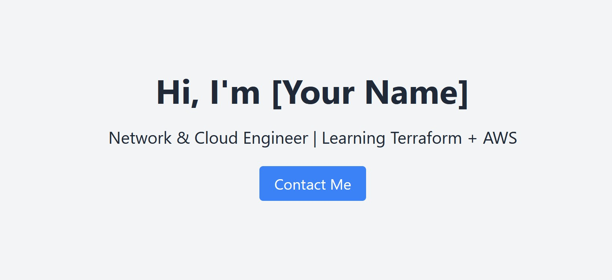

# Beginner-Friendly Guide: Portfolio Website Deployment with Terraform + AWS + GitHub

This guide helps you build, document, and **deploy your portfolio website** on **AWS** using **Terraform** and **GitHub Actions** — all beginner-friendly!

---

## 🧭 Overview

We will:

1. Build a simple static portfolio site.
2. Use **Terraform** to create AWS infrastructure (S3 + CloudFront).
3. Deploy automatically through **GitHub Actions**.
4. Document it beautifully in your GitHub repo.

---

## 🛠️ Step 1: Set Up Your Tools

### You’ll need:

* **GitHub account** → [https://github.com](https://github.com)
* **AWS account** → [https://aws.amazon.com](https://aws.amazon.com)
* **Terraform installed** → [Terraform Download](https://developer.hashicorp.com/terraform/downloads)
* **AWS CLI installed** → [AWS CLI Install](https://docs.aws.amazon.com/cli/latest/userguide/getting-started-install.html)

### Configure AWS CLI

Run this in your terminal:

```bash
aws configure
```

Then enter your AWS Access Key, Secret Key, and Region (for example, `us-east-1`).

---

## 📁 Step 2: Create a GitHub Repository

1. On GitHub, click **New Repository** → name it `portfolio-terraform-aws`.
2. Choose **Public** and **Add a README file**.
3. Clone the repo locally:

```bash
git clone https://github.com/yourusername/portfolio-terraform-aws.git
cd portfolio-terraform-aws
```

4. Create this folder structure:

```
portfolio-terraform-aws/
├── site/
│   └── index.html
├── terraform/
│   ├── main.tf
│   ├── variables.tf
│   ├── outputs.tf
├── .github/
│   └── workflows/
│       └── deploy.yml
└── README.md
```

---

## 🌐 Step 3: Create Your Website

Inside `site/index.html`, add this:

```html
<!DOCTYPE html>
<html lang="en">
<head>
  <meta charset="UTF-8">
  <meta name="viewport" content="width=device-width, initial-scale=1.0">
  <title>My Portfolio</title>
  <link href="https://cdn.jsdelivr.net/npm/tailwindcss@2.2.19/dist/tailwind.min.css" rel="stylesheet">
</head>
<body class="bg-gray-100 text-gray-800">
  <div class="text-center mt-20">
    <h1 class="text-4xl font-bold mb-4">Hi, I'm [Your Name]</h1>
    <p class="text-lg">Network & Cloud Engineer | Learning Terraform + AWS</p>
    <div class="mt-6">
      <a href="mailto:youremail@example.com" class="bg-blue-500 text-white px-4 py-2 rounded">Contact Me</a>
    </div>
  </div>
</body>
</html>
```

---

## ☁️ Step 4: Create Terraform Infrastructure

### 1. Terraform Configuration

Create `terraform/main.tf`:

```hcl
terraform {
  required_providers {
    aws = {
      source  = "hashicorp/aws"
      version = "~> 5.0"
    }
  }
}

provider "aws" {
  region = var.aws_region
}

resource "aws_s3_bucket" "portfolio" {
  bucket = var.bucket_name
  website {
    index_document = "index.html"
  }
}

resource "aws_s3_bucket_policy" "public_read" {
  bucket = aws_s3_bucket.portfolio.id
  policy = jsonencode({
    Version = "2012-10-17"
    Statement = [
      {
        Effect = "Allow"
        Principal = "*"
        Action = ["s3:GetObject"]
        Resource = ["${aws_s3_bucket.portfolio.arn}/*"]
      }
    ]
  })
}

resource "aws_s3_bucket_public_access_block" "allow_public" {
  bucket = aws_s3_bucket.portfolio.id
  block_public_acls       = false
  block_public_policy     = false
  ignore_public_acls      = false
  restrict_public_buckets = false
}

output "website_endpoint" {
  value = aws_s3_bucket.portfolio.website_endpoint
}
```

### 2. Variables

`terraform/variables.tf`:

```hcl
variable "aws_region" {
  default = "us-east-1"
}

variable "bucket_name" {
  description = "Unique S3 bucket name"
  default = "my-terraform-portfolio-site-12345"
}
```

### 3. Outputs

`terraform/outputs.tf`:

```hcl
output "website_endpoint" {
  description = "URL of the hosted portfolio website"
  value       = aws_s3_bucket.portfolio.website_endpoint
}
```

---

## 🚀 Step 5: Deploy Infrastructure with Terraform

### Option 1: Deploy Locally

```bash
cd terraform
terraform init
terraform apply -auto-approve
```

Terraform will create your S3 bucket and show your **website endpoint**.

You can then upload your site manually:

```bash
aws s3 sync ../site/ s3://my-terraform-portfolio-site-12345 --delete
```

Visit your endpoint to see your site live 🎉

---

## ⚙️ Step 6: Automate with GitHub Actions

### Add AWS Secrets

In your GitHub repository → **Settings → Secrets and variables → Actions**:
Add these secrets:

* `AWS_ACCESS_KEY_ID`
* `AWS_SECRET_ACCESS_KEY`

### Create Workflow

`.github/workflows/deploy.yml`:

```yaml
name: Deploy Portfolio Website

on:
  push:
    branches: ["main"]

jobs:
  deploy:
    runs-on: ubuntu-latest

    steps:
      - name: Checkout Code
        uses: actions/checkout@v4

      - name: Setup Terraform
        uses: hashicorp/setup-terraform@v2
        with:
          terraform_version: 1.6.0

      - name: Configure AWS
        uses: aws-actions/configure-aws-credentials@v2
        with:
          aws-access-key-id: ${{ secrets.AWS_ACCESS_KEY_ID }}
          aws-secret-access-key: ${{ secrets.AWS_SECRET_ACCESS_KEY }}
          aws-region: us-east-1

      - name: Terraform Init & Apply
        working-directory: terraform
        run: |
          terraform init
          terraform apply -auto-approve

      - name: Upload Website to S3
        run: |
          aws s3 sync site/ s3://my-terraform-portfolio-site-12345 --delete
```

---

## 🌍 Step 7: Deploy via GitHub

1. Push your project to GitHub:

```bash
git add .
git commit -m "Initial portfolio deployment"
git push origin main
```

2. Open **Actions** tab → watch the Terraform + AWS deployment.
3. After it finishes, check the **website endpoint** in the logs.
4. Open it in your browser — your site is live! 🚀

---

## 🧹 Step 8: Clean Up

When you’re done testing:

```bash
cd terraform
terraform destroy -auto-approve
```

This removes all AWS resources.

---

## 🌟 Step 9: Improve Your Portfolio

Enhance your site with:

* **Project Cards:** Add details about your work.
* **Custom Domain:** Use Route53 + CloudFront + ACM for HTTPS.
* **Contact Form:** AWS Lambda + SES.
* **Professional README:** Add screenshots and badges.

---


## 📸 Deployment Screenshots

### 1. Terraform Apply




### 2. AWS S3 Bucket


### 3. Live Portfolio Website



## ✅ Summary

You’ve successfully **deployed a portfolio website** using **Terraform + AWS** — automated through **GitHub Actions**.

This project demonstrates your understanding of:

* Infrastructure as Code (IaC)
* AWS S3 static hosting
* CI/CD automation via GitHub Actions
* Cloud deployment fundamentals


